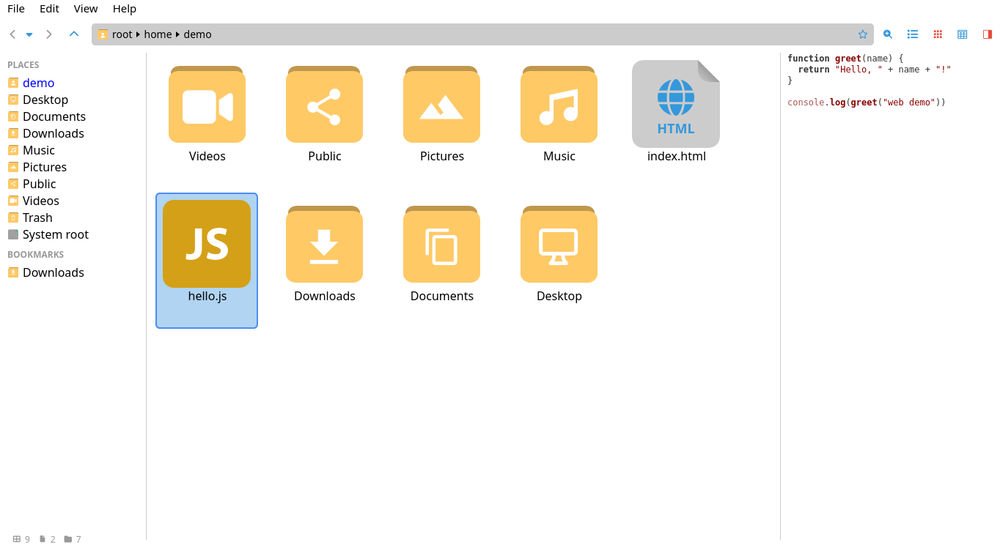

# file-manager
Just a file manager on electron+vue



## Stack
- Electron (main + preload in TypeScript, compiled to `dist-electron/`)
- Vue 3 (Options API, `<script lang="ts">`)
- TypeScript (`tsc` for type-checking, ESLint + `@vue/typescript/recommended` for linting)
- Vitest — unit tests
- Playwright — end-to-end tests

## Project setup
```
npm install
```

Note: install may require `--legacy-peer-deps` (pre-existing `cache-loader` ↔ `webpack` peer conflict in vue-cli 5).

## Start app
```
npm start
```
Builds the electron main process (`dist-electron/`), compiles the renderer, then launches Electron.

### Compiles and hot-reloads for development
```
npm run serve
```

### Compiles and minifies for production
```
npm run build
```

### Lints files (TypeScript + Vue)
```
npm run lint
```

### Type-checks the renderer
```
npm run typecheck
```

### Runs unit tests
```
npm test
```

### Runs end-to-end tests (requires a display)
```
npm run test:e2e
```

### Customize configuration
See [Configuration Reference](https://cli.vuejs.org/config/).
